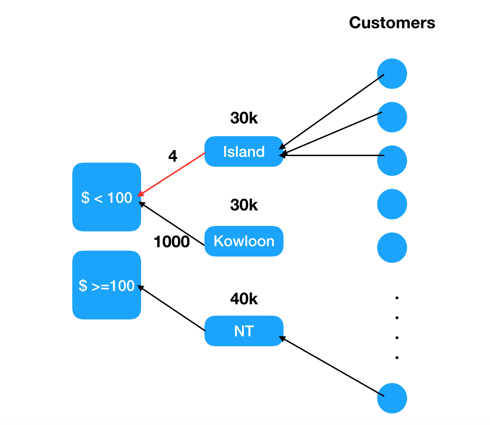

# toxic-combination
toxic-combination

Problem Definition: If the search count N on the combination of filter on customer attributes (K1,K2,...Kp), N < the threshold e.g. 5, then that combination (K1,K2,..Kp) is toxic, because we can easily identify the customer based on the customer attributes K1,K2,...Kp.


Example Case:
<br/>Customer 1 has account balance 500k, and live in Wan Chai.  The Search filter combination is: low income and living district.
<br/>Filter 1 of low income K1 is defined as account balance < 100, and balance >=100, so in case of customer 1, filter function K1(500k) = ">= 100".
<br/>Filter 2 of living district is defined as (Island,Kowloon, NT), so in case of customer 1, filter function K2("Wan Chai") = "Island".
<br/>If we have ~1 million customer data, and count them based on the 2 attribute filters, we will get the search count matrix, e.g.

| District | balance < 100 | balance >= 100 |
| --- | --- | --- |
| Island | 4 | 30k |
| Kowloon | 1000 | 30k |
| NT | 10k | 30k |

Since there are only 4 customers having balance<100, and living in hk island, so "balance<100" and "Living in Island" is a toxic combination.



Suppose each cusomter i has attribute data D(i,j) where i = 1 to 1 million, and j = 1, 2
The search count matrix can be computed by the following MapReduce phase:

###Map Phase:
```
For each csutomer i, emit( [ K1(D(i,1) , K2(Di,2) ] , 1)
e.g. emit( [ "balance>=100" , "Island" ] , 1 )
```
###Reduce by Key
```
reduce( [Ki1,Ki2] , sum(Vi) )
e.g. reduce( [K11,K12]=["balance<100","Island" , sum=4 ) => 4
```
##In general case:

<br/>Suppose each cusomter i has attribute data D(i,j) where i = 1 to n and j = 1, 2, ..p.
<br/>Filter function is Kj(Dij) 
<br/>Matrix of the number of customer with filter on condition K1, K2, ...Kp can be obtained by MapReduce:

###Mapper: 
```
emit( [ Kj(Dij) ] , 1 )
```
###Reduce by key 
```
Reduce( [Kj(Dij)] , sum(Vi) )
```
